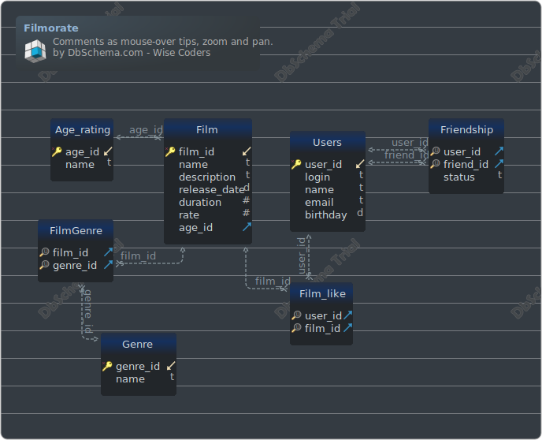

#Filmorate

### Layout

## Реализованные алгоритмы
1. [FT-1] Функциональность "Лента событий" - Михаил (mvinogradovHub)
2. [FT-2] Функциональность "Поиск" - Игорь (MR-k0f31n)
3. [FT-3] Функциональность "Вывод самых популярных фильмов по жанру и годам" - Руслан (NiceTulipe)
4. [FT-4] Функциональность "Удаление фильмов и пользователей" - Денис (ReTerWert)
5. [FT-5] Функциональность "Добавление режиссёров в фильмы" - Денис (ReTerWert)
6. [FT-6] Функциональность "Общие фильмы" - Денис (ReTerWert)
7. [FT-7] Функциональность "Рекомендации" - Александр (84R5)
8. [FT-8] Функциональность "Отзывы" - Денис (ReTerWert)

## Tables

1. [public.Age_rating](#table-public.age\_rating) 2. [public.Film](#table-public.film) 3. [public.Film_like](#table-public.film\_like) 4. [public.FilmGenre](#table-public.filmgenre) 5. [public.Friendship](#table-public.friendship) 6. [public.Genre](#table-public.genre) 7. [public.Users](#table-public.users)

### Table public.Age_rating
| | | |
|---|---|---|
| * &#128273;  &#11019; | age\_id| INT AUTO_INCREMENT |
|  | name| VARCHAR(255)  |

##### Indexes
| | | |
|---|---|---|
| &#128273;  | pk\_age\_rating | ON age\_id|

### Table public.Film
| | | |
|---|---|---|
| * &#128273;  &#11019; | film\_id| INT AUTO_INCREMENT |
|  | name| VARCHAR(255)  |
|  | description| VARCHAR(255)  |
|  | release\_date| DATE  |
|  | duration| BIGINT  |
|  | rate| INT  |
| &#11016; | age\_id| INT  |

##### Indexes
| | | |
|---|---|---|
| &#128273;  | pk\_film | ON film\_id|

##### Foreign Keys
| | | |
|---|---|---|
|  | fk_Film Age_rating | ( age\_id ) ref [public.Age\_rating](#Age\_rating) (age\_id) |

### Table public.FilmGenre
| | | |
|---|---|---|
| &#128269; &#11016; | film\_id| INT  |
| &#128269; &#11016; | genre\_id| INT  |

##### Indexes
| | | |
|---|---|---|
| &#128269;  | pk\_filmgenre | ON film\_id, genre\_id|

##### Foreign Keys
| | | |
|---|---|---|
|  | fk_FilmGenre Film | ( film\_id ) ref [public.Film](#Film) (film\_id) |
|  | fk_FilmGenre Genre | ( genre\_id ) ref [public.Genre](#Genre) (genre\_id) |

### Table public.Film_like
| | | |
|---|---|---|
| &#128269; &#11016; | user\_id| INT  |
| &#128269; &#11016; | film\_id| INT  |

##### Indexes
| | | |
|---|---|---|
| &#128269;  | pk\_film\_like | ON user\_id, film\_id|

##### Foreign Keys
| | | |
|---|---|---|
|  | fk_Film_like Users | ( user\_id ) ref [public.Users](#Users) (user\_id) |
|  | fk_Film_like Film | ( film\_id ) ref [public.Film](#Film) (film\_id) |

### Table public.Friendship
| | | |
|---|---|---|
| &#128269; &#11016; | user\_id| INT  |
| &#128269; &#11016; | friend\_id| INT  |
|  | status| VARCHAR(255)  |

##### Indexes
| | | |
|---|---|---|
| &#128269;  | pk\_friendship | ON user\_id, friend\_id|

##### Foreign Keys
| | | |
|---|---|---|
|  | fk_Friendship Users | ( user\_id ) ref [public.Users](#Users) (user\_id) |
|  | fk_Friendship Users_001 | ( friend\_id ) ref [public.Users](#Users) (user\_id) |

### Table public.Genre
| | | |
|---|---|---|
| * &#128273;  &#11019; | genre\_id| INT AUTO_INCREMENT |
|  | name| VARCHAR(255)  |

##### Indexes
| | | |
|---|---|---|
| &#128273;  | pk\_genre | ON genre\_id|

### Table public.Users
| | | |
|---|---|---|
| * &#128273;  &#11019; | user\_id| INT AUTO_INCREMENT |
|  | login| VARCHAR(255)  |
|  | name| VARCHAR(255)  |
|  | email| VARCHAR(255)  |
|  | birthday| DATE  |

##### Indexes
| | | |
|---|---|---|
| &#128273;  | pk\_users | ON user\_id|